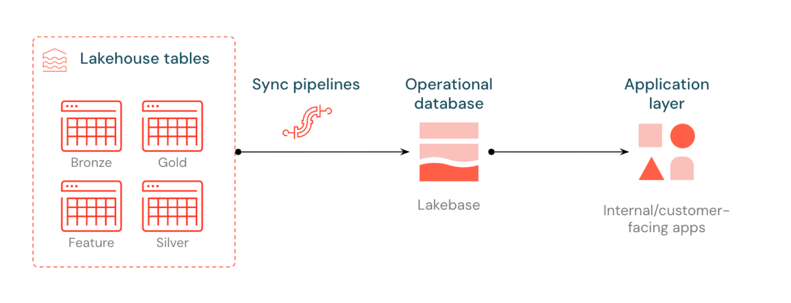
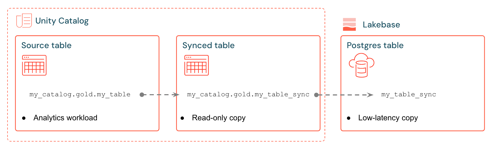

# Reverse ETL

Sync Delta Lake tables from the Lakehouse into Lakebase for low-latency serving.

## What to run

| Open this | What You'll Learn |
|-----------|-------------------|
| [`Reverse_ETL.py`](Reverse_ETL.py) | Create a Delta source table (or use your own), set up a synced table, monitor sync status, observe incremental changes |

## Prerequisites

- Complete **`00_Setup_Lakebase_Project`** (foundation)

## How it works

Synced tables (Reverse ETL) copy Unity Catalog data into Lakebase Postgres so applications can run fast lookups. Creating a synced table gives you a **Lakeflow sync pipeline** plus a serving table in Postgres (treat as read-only). Diagrams from the [official docs](https://docs.databricks.com/aws/en/oltp/projects/sync-tables):

## Bring Your Own Data

The lab generates a sample Delta table by default, but you can sync any existing Delta table instead. Set `USE_OWN_DATA = True` in the configuration cell and point `SOURCE_TABLE` to your own table. The only requirement is that your table has **Change Data Feed** enabled.

If you don't have a table ready, the lab creates a catalog, schema, and sample data for you automatically.

## Key Concepts

- **Synced tables** — Managed one-way copy from Unity Catalog → Lakebase (control-plane object in UC + Postgres serving table)
- **Sync pipeline** — Managed Lakeflow pipeline that refreshes both surfaces from the source
- **Change Data Feed (CDF)** — Delta feature required for Triggered / Continuous incremental sync
- **Service Principal grants** — Required for the sync pipeline (and Lab Console) to access synced tables in Lakebase

## Sync Pipeline Modes

Synced tables support three scheduling modes. Choose the right one based on freshness requirements, cost tolerance, and source table characteristics.

| Mode | How It Works | When to Use | CDF Required? |
|------|-------------|-------------|---------------|
| **Snapshot** | Full copy of all data each sync cycle | Source changes >10% of rows per cycle; source doesn't support CDF (views, Iceberg tables) | No |
| **Triggered** | Incremental updates run on demand or at intervals | Source rows change on a known cadence; best cost/freshness balance | Yes |
| **Continuous** | Real-time streaming with seconds of latency | Changes must appear in Lakebase in near real time | Yes |

### Snapshot

Performs a full replacement of all data on each sync. Approximately 10x more efficient than incremental modes when more than 10% of rows change per cycle. This is the **only** option for sources that don't support Change Data Feed — including views, materialized views, and Iceberg tables. Subsequent syncs must be triggered explicitly or on a cron schedule.

**Throughput:** ~2,000 rows/sec per CU

### Triggered

Propagates inserts, updates, and deletes incrementally using Change Data Feed. After the initial sync, subsequent syncs must be triggered explicitly — either manually from Catalog Explorer, via the SDK, or by scheduling a **Database Table Sync pipeline** task in Lakeflow Jobs. This gives precise control over when syncs run and is the most cost-effective option for tables that change on a predictable cadence.

**Throughput:** ~150 rows/sec per CU  
**Note:** Running triggered syncs at intervals shorter than 5 minutes can become expensive.

### Continuous

Fully self-managing — once started, it streams changes from the source table to Lakebase with near-real-time latency (seconds, minimum 15-second intervals). Provides the lowest lag but at the highest cost, since the pipeline runs continuously.

**Throughput:** ~150 rows/sec per CU

### Scheduling Triggered & Snapshot Syncs

For Snapshot and Triggered modes, the initial sync runs automatically on creation. To automate subsequent syncs, create a Lakeflow Job with a **Database Table Sync pipeline** task:

- **Table update trigger** — fires when the source Unity Catalog table is updated, giving near-real-time freshness without the always-on cost of Continuous mode
- **Cron schedule** — runs the sync at a fixed cadence (e.g., nightly or hourly), well-suited for Snapshot mode

### Capacity Planning

- Each synced table uses up to **16 connections** to your Lakebase database
- Total logical data size limit across all synced tables: **16 TB**
- Individual tables should not exceed **1 TB** for tables requiring refreshes
- Only additive schema changes (e.g., adding columns) are supported for Triggered and Continuous modes

## Documentation

- [Serve lakehouse data with synced tables](https://docs.databricks.com/aws/en/oltp/projects/sync-tables)
- [Sync modes reference](https://docs.databricks.com/aws/en/oltp/projects/sync-tables#sync-modes)
- [Schedule syncs with Lakeflow Jobs](https://docs.databricks.com/aws/en/oltp/projects/sync-tables#schedule-or-trigger-subsequent-syncs)
- [Use Delta Lake change data feed](https://docs.databricks.com/aws/en/delta/delta-change-data-feed)
- [Unity Catalog Access](../unity-catalog-access/) — federated live reads (no copy); complementary to synced tables
- [Lakehouse Sync](../lakehouse-sync/) — Postgres → Delta CDC history

## Notes

See `docs/PERMISSIONS.md` for the Service Principal grants needed for synced tables.
